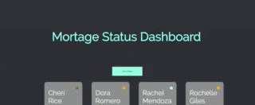

This project was bootstrapped with [Create React App](https://github.com/facebook/create-react-app).

### Build with: 
  - React.js
  - Mongoose
  - Express.js
  - Next.js
  - Node.js
## Available Scripts

In the project directory, you can run:

### `npm start`
  That will build and run the server

### Deployed link: 
  https://userdashboardmortage.herokuapp.com/

### Demo: 
  